# EKKL3S1A Themes

> **Version 0.0.2** · [Changelog](CHANGELOG.md)

A collection of four handcrafted dark themes for Visual Studio Code, optimised for Angular, TypeScript, RxJS, and HTML development.

---

## Themes

### 🍷 Burgundy Night

A deep, moody dark theme built around rose and burgundy tones. Warm and elegant, ideal for long coding sessions.

<div align="center">
  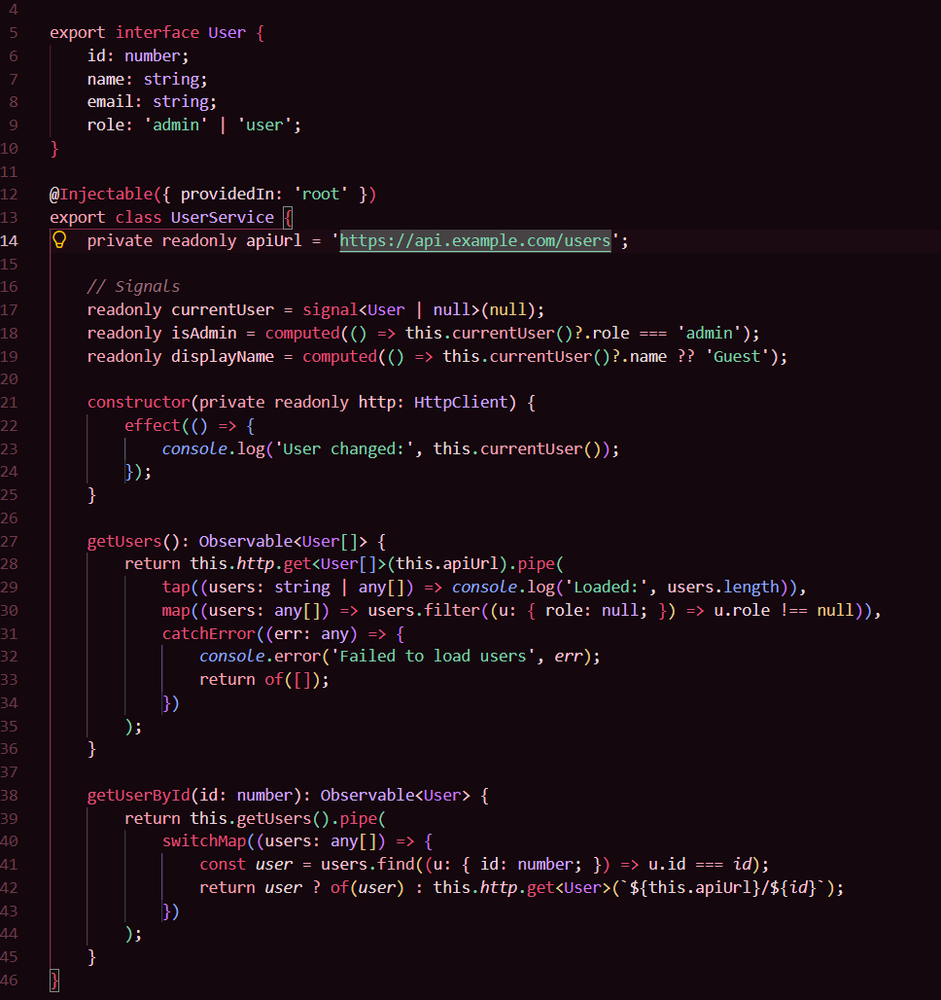
  <p><em>Classes, decorators, RxJS, signals, async</em></p>
</div>

<div align="center">
  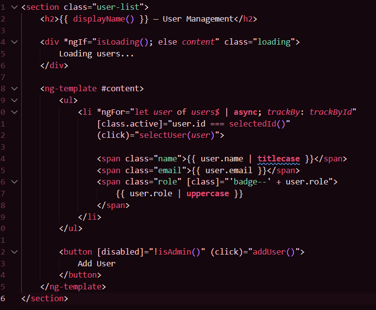
  <p><em>Angular templates, bindings, pipes</em></p>
</div>

<div align="center">
  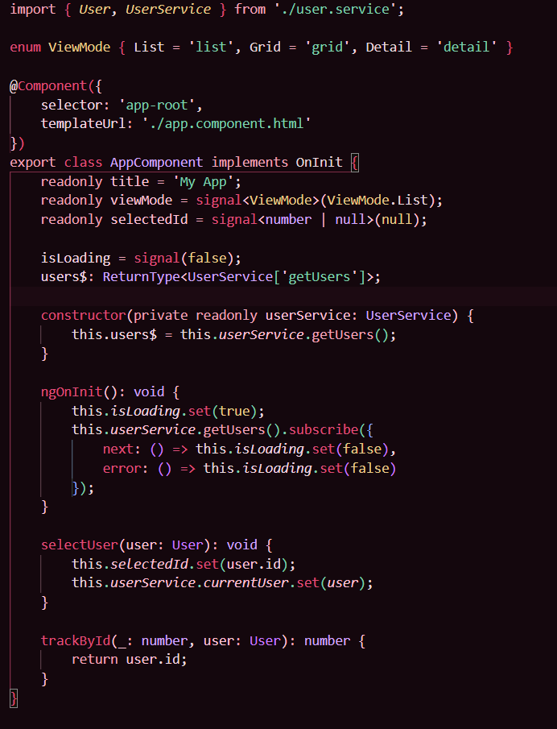
  <p><em>Types, interfaces, enums</em></p>
</div>

- **Primary accent:** Rose `#E04F7B`
- **Strings:** Soft pink `#FFC2D7`
- **Types / Classes:** Lavender `#D2A8FF`
- **RxJS / Async:** Mint green `#7FD1AE`
- **Keywords:** Rose `#E04F7B`
- **Numbers / Constants:** Gold `#EBCB8B`

---

### 💜 Purple Pink (Dark)

A vibrant dark theme combining deep purples with hot pink accents. High contrast and energetic.

<div align="center">
  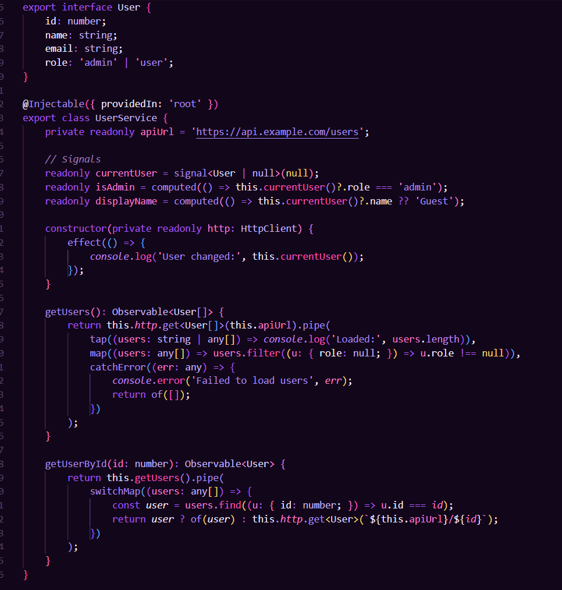
  <p><em>Classes, decorators, RxJS, signals, async</em></p>
</div>

<div align="center">
  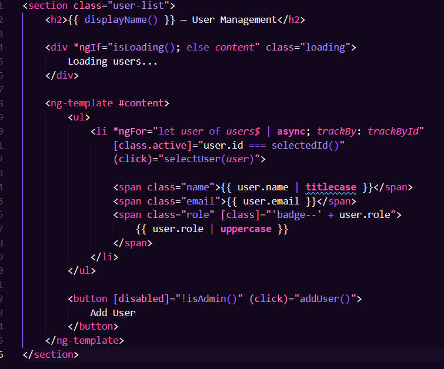
  <p><em>Angular templates, bindings, pipes</em></p>
</div>

<div align="center">
  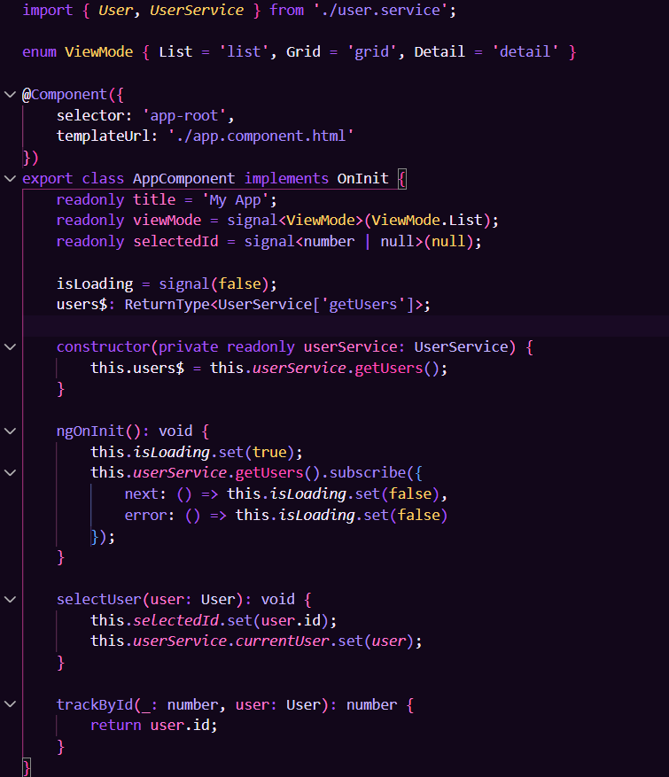
  <p><em>Types, interfaces, enums</em></p>
</div>

- **Primary accent:** Hot pink `#FF4DB8`
- **Strings:** Soft pink `#FF7ACD`
- **Types / Classes:** Light purple `#C4B5FD`
- **Functions:** Soft purple `#A78BFA`
- **Keywords:** Deep purple `#A855F7`
- **Numbers / Constants:** Gold `#FFD166`

---

### 🩵 Teal Turquoise

A cool, refreshing dark theme built around teal and turquoise tones with green and blue highlights.

<div align="center">
  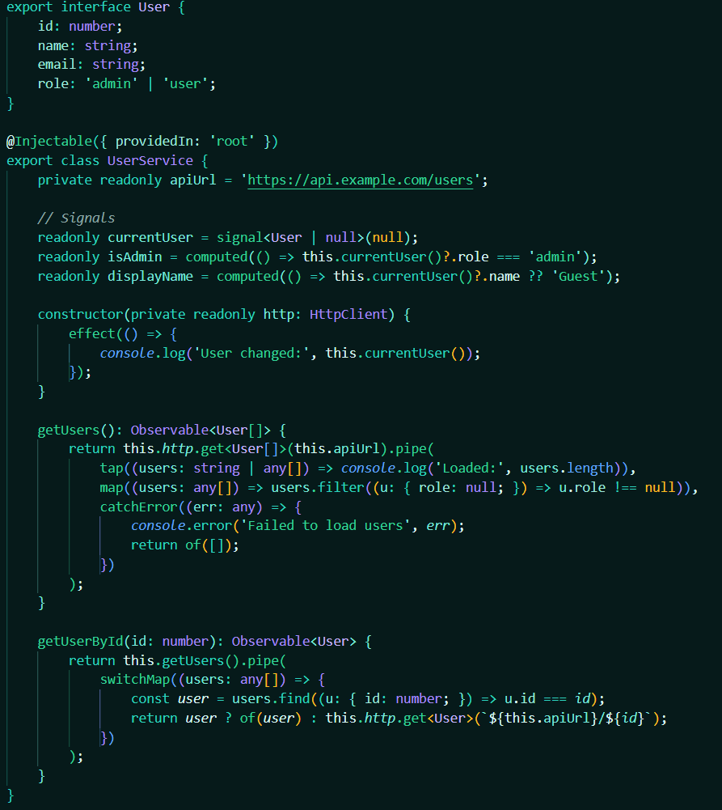
  <p><em>Classes, decorators, RxJS, signals, async</em></p>
</div>

<div align="center">
  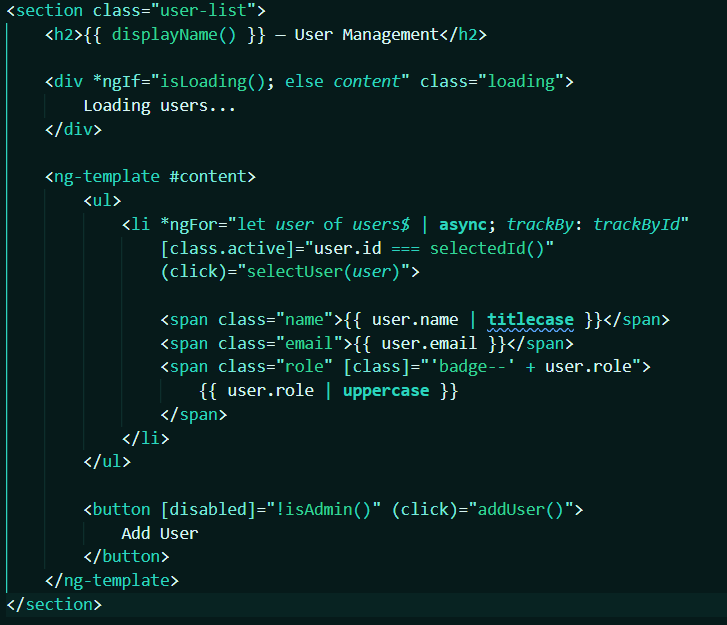
  <p><em>Angular templates, bindings, pipes</em></p>
</div>

<div align="center">
  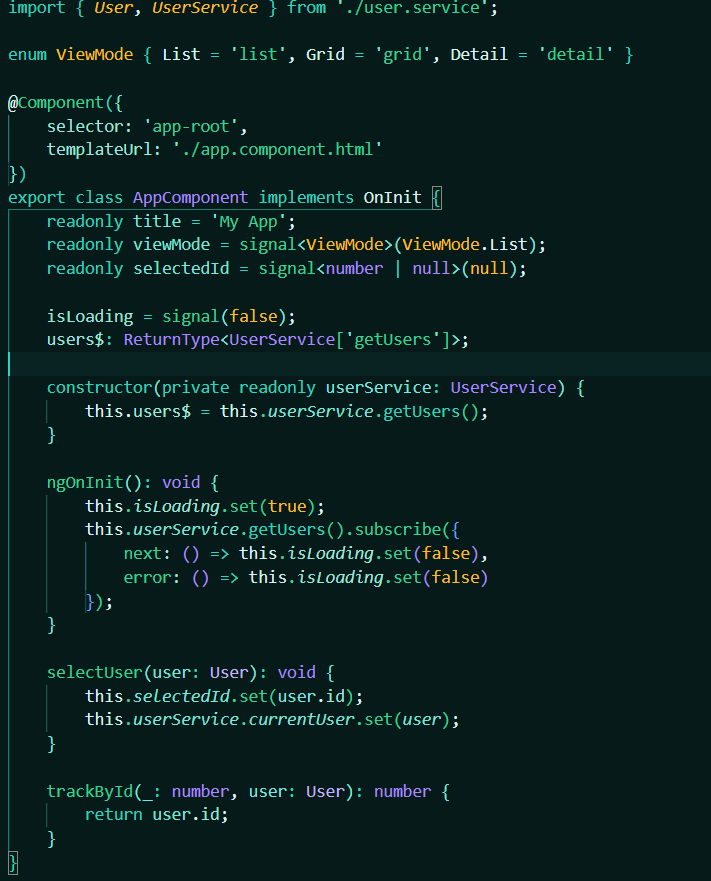
  <p><em>Types, interfaces, enums</em></p>
</div>

- **Primary accent:** Teal `#2DD4BF`
- **Strings:** Light teal `#7AE7DA`
- **Types / Classes:** Soft purple `#A78BFA`
- **Functions:** Green `#34D399`
- **Keywords:** Teal `#2DD4BF`
- **Numbers / Constants:** Amber `#FBBF24`

---

### 🖖 Star Trek: LCARS

A distinctive dark theme inspired by the iconic LCARS (Library Computer Access/Retrieval System) interface from Star Trek. Features warm golds and oranges with blue accents on a deep space background.

<div align="center">
  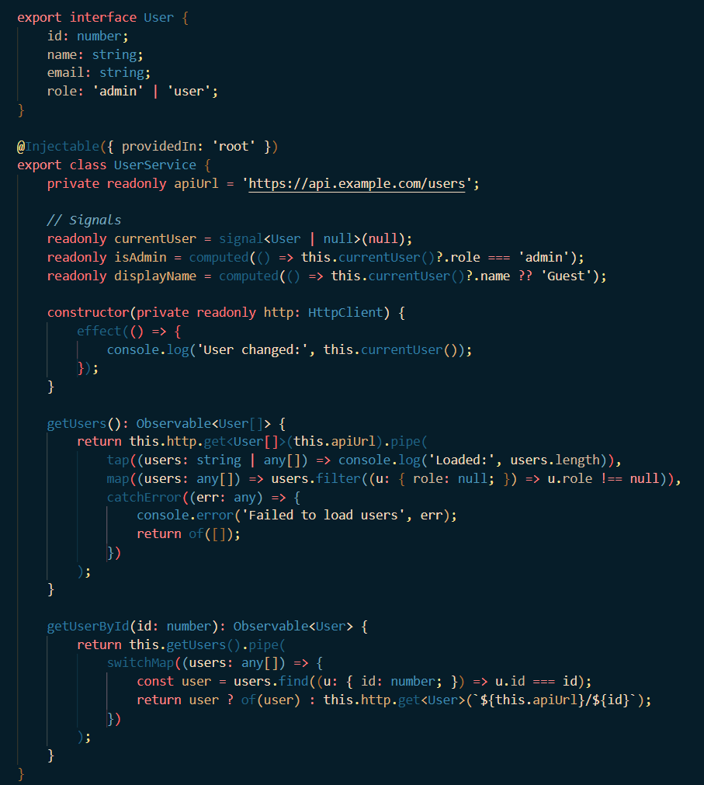
  <p><em>Classes, decorators, RxJS, signals, async</em></p>
</div>

<div align="center">
  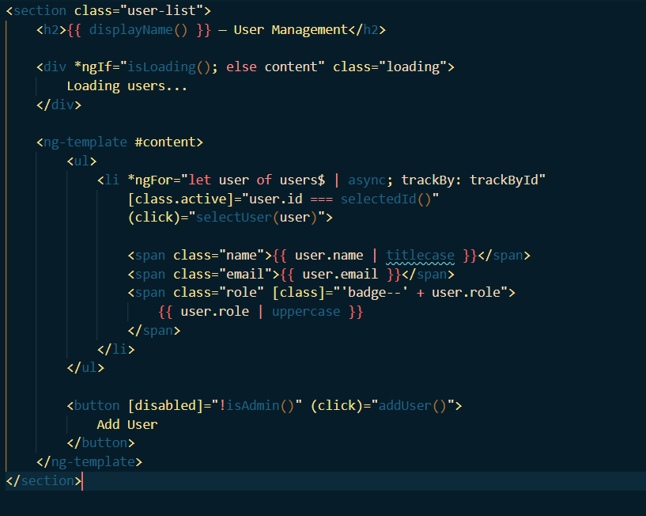
  <p><em>Angular templates, bindings, pipes</em></p>
</div>

<div align="center">
  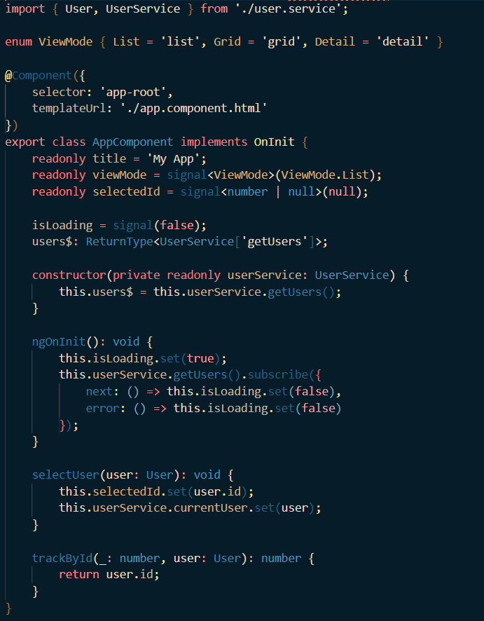
  <p><em>Types, interfaces, enums</em></p>
</div>

- **Primary accent:** Orange gold `#AB7130`
- **Strings:** Cream `#F1DABF`
- **Types / Classes:** Light blue `#4A95B8`
- **Functions:** Blue `#206383`
- **Keywords:** Red `#FF7777`
- **Numbers / Constants:** Gold `#DFAF79`

---

## Requirements

- **Visual Studio Code** `1.120.0` or higher
- Recommended: enable **semantic highlighting** in your settings (see [Recommended Settings](#recommended-settings))

---

## Tested Languages

| Language | Support |
|---|---|
| TypeScript / JavaScript | ✅ Full semantic + token colours |
| Angular Templates (HTML) | ✅ Bindings, interpolation, directives, signals |
| HTML | ✅ Tags, attributes, values |
| SCSS / CSS | ✅ Properties, values, selectors |
| JSON / JSONC | ✅ Keys, strings, numbers |
| Markdown | ✅ Headings, code blocks, links |

---

## Features

All four themes include full support for:

- **Semantic highlighting** — precise token colours for TypeScript, JavaScript, HTML, CSS/SCSS
- **Angular templates** — interpolation `{{ }}`, property bindings `[value]`, event bindings `(click)`, structural directives `*ngIf` / `*ngFor`
- **Angular Signals** — `signal()`, `computed()`, `effect()`
- **RxJS operators** — `map`, `switchMap`, `mergeMap`, `tap`, `filter`, `catchError`, `exhaustMap`
- **Bracket pair colourisation** — 6-depth colour nesting with matching pair guides
- **Terminal colours** — consistent ANSI colour palette per theme

---

## Installation

### From a `.vsix` file

> Requires `vsce`: `npm install -g @vscode/vsce`

1. Package the extension:

   ```bash
   vsce package
   ```

2. Install the generated `.vsix`:

   ```bash
   code --install-extension ekkl3s1a-themes-0.0.1.vsix
   ```

### From the VS Code UI

1. Open VS Code.
2. Go to **Extensions** (`Ctrl+Shift+X`).
3. Click the **`···`** menu → **Install from VSIX…**
4. Select the `.vsix` file.

---

## Activating a Theme

1. Open the Command Palette (`Ctrl+Shift+P`).
2. Run **Preferences: Color Theme**.
3. Select one of:
   - `Burgundy Night`
   - `Purple Pink (Dark)`
   - `Teal Turquoise`
   - `Star Trek: LCARS`

---

## Recommended Settings

For the best experience, add the following to your `settings.json`:

```json
{
    "editor.semanticHighlighting.enabled": true,
    "editor.bracketPairColorization.enabled": true,
    "editor.guides.bracketPairs": "active"
}
```

**Enjoy!**
